# HA Orchestrator

> *Model outages end long runs. Not anymore.*

[](README.md)
[](https://github.com/deepseek-ai/dsh)
[](#installation)
[](#project-structure)
[](LICENSE)

<br>

**HA Orchestrator** is a dynamic Cordis plugin for DeepSeek Harness (dsh) that keeps
agent runs alive when models fail, and gives the main agent a planning–executing–supervising
loop.

<br>

**🛡️ Model high-availability failover** — when a model errors mid-run, the failing model is
quarantined (with cooldown), the request is retried on a backup model, and the run continues
where it stopped. No manual intervention.

**🧩 Subagent orchestration** — one `orchestrate` tool with three modes:
`fanout` (parallel + merge), `pipeline` (sequential stages), `supervisor` (parallel, then a
supervising agent synthesizes).

**🤖 Custom subagents** — define name / model / description / system prompt in the config page,
assign by name from any task, or generate a subagent with AI in one click.

[**简体中文**](README.zh-CN.md) · [Highlights](#highlights) · [How it works](#how-it-works) · [Installation](#installation) · [Usage](#usage) · [Documentation](#documentation)

</div>

---

## Highlights

- **🛡️ Model high availability.** Listens at the outermost layer of the request waterfall
  (`agent/request` + `agent/request-error`, `prepend: true`), so it holds the final say. A
  failure (error-code match, empty = all) quarantines the failing model for `cooldownMs`, then
  returns `{kind: 'retry'}`; the loop re-issues the request on the next backup model and the
  session header persists the new model for subsequent steps. Backups rotate round-robin per
  agent and skip unregistered providers (no `NO_ADAPTER` cascade).
- **↩️ Stop recovery.** If a model error interrupts the run (`agent/error`), the failing model
  is quarantined first, then `agent.steer` restarts the run 300ms later — once the driver has
  rolled back to idle — and keeps the task going. One steer per turn.
- **🧩 Orchestration.** `orchestrate` is a per-agent scoped tool built on
  `subagents.start` with a bounded concurrency pool, a task cap (`maxAgents`), and cancellation
  propagation. The tool description always lists the currently configured custom subagents.
- **🤖 Custom subagents.** Each definition carries **name / model / description / system
  prompt**. Tasks pick them by name (`tasks[].agent`, top-level `agent`, `supervisorAgent`);
  the model routes through `agentOptions` and the persona through `request.persona`.
- **✨ AI-generated subagents.** Hit 「智能新增」 in the config page, describe what you need,
  and the host uses the current default model to generate a full definition (name/model/
  description/system prompt) — JSON-parsed, deduplicated, and prefilled into the edit form.
- **🎛️ Visual config page.** Settings → "HA 与编排": backup list with an add-from-config
  picker, cooldown / threshold / error-code / steering knobs, quarantine table and switch
  history. The Run card shows a live HA status strip.
- **🎨 OpenDesign tokens.** The config page consumes global OpenDesign semantic tokens
  (`--dsw-alias-*`) — correct colors in both light and dark themes, no design-package dependency.

## How it works

HA Orchestrator is a **DSH dynamic Cordis plugin** with two halves, deployed as pure JS
function bodies (`host.js` / `client.js`) — no dependencies, no build step;

**Failover flow.** Error → code matches → count against threshold → quarantine + pick next
backup (round-robin, skips quarantined / unregistered) → `{kind: 'retry'}` → request re-issued
on the backup → session header updated → the run continues on the backup model. The failing
model recovers automatically when its cooldown expires:



**Lifecycle.** Config persists to `ha-orchestrator.config.json` (with a
`ha-orchestrator.config.backup.json` fallback copy) in the plugin directory — restored on startup
and rewritten on every config change. Quarantine / counters / history stay in host memory and
reset on plugin update or process restart.

## Installation

HA Orchestrator is a DSH dynamic Cordis plugin — no packages, no build step, just two JS
function bodies (`host.js` / `client.js`) that the harness runs directly.

**Step 1, switch to a create-mode (cordis) session.** The `tool-cordis` toolset is only
assembled in the create mode (cordis) preset — a standard session has no `cordis_define`.
The plugin is deployed per session; it does not survive restarts.

**Step 2, hand it to your AI.** Send it this line:

> Deploy the HA Orchestrator plugin: run `cordis_define` (kind: `new`, idPrefix: `haorc`)
> with `code.host` set to the full contents of `host.js` and `code.client` to the full
> contents of `client.js` (both in this repository), then `cordis_run` (mode: `run`) and
> tell me the result.

The AI reads both files from the repository, registers the plugin with the harness, and
starts it.

**Step 3, approve it on the Run card.** The first run of a new Package sits in
awaiting-approval until you click ✓ — a UI gesture, independent of the session approval
policy.

**Step 4, verify it works.** `Tool.listTools` should contain `orchestrate`; Settings shows
"HA 与编排"; the HA listeners are visible in the event catalog.

**Updating later.** `cordis_define` (kind: `existing`) with a new Package → `cordis_run`
(mode: `update`) — the plugin re-installs with the latest code.

## Usage

Once installed, just talk. The model decides when to orchestrate:

```
You:    帮我调研这三个开源项目，比较许可证和社区活跃度，给出选型建议。
Model:  (拆解为 3 个独立子任务，调用 orchestrate mode=fanout)
        → 并行调研 → 汇总对比表 → 给出建议

You:    先做需求分析，再写设计文档，最后写实现计划。
Model:  (调用 orchestrate mode=pipeline)
        → 每阶段输出自动成为下一阶段上下文

You:    生成一份竞品分析报告，找个资深评审把关。
Model:  (调用 orchestrate mode=supervisor, supervisorAgent=reviewer)
        → 并行分析 → 评审合成 → 输出报告
```

**Config page tour** (Settings → "HA 与编排"):

| Area | What you can do |
| :-- | :-- |
| 模型高可用 | Toggle, backup list (add from installed providers, reorder, remove), cooldown, failure threshold, error-code filter, persist selection, steer-on-stop, quarantine & history view, reset |
| 子智能体编排 | Toggle, subagent provider, default concurrency, max agents per run |
| 自定义子智能体 | CRUD + reorder; name is required, provider/model optional (inherit parent), description shown to the model, system prompt becomes the persona; 「智能新增」 generates one with AI |

## Feature reference

| Feature | Behavior |
| :-- | :-- |
| HA failover | Outermost waterfall listeners; quarantine + cooldown + round-robin backup; per-agent rotation cursor; skips unregistered providers |
| Stop recovery | `agent/error` with model codes → quarantine → delayed `agent.steer` (once per turn) |
| `orchestrate` tool | `fanout` / `pipeline` / `supervisor`; `tasks[]`, `agent`, `supervisorAgent`, `concurrency`; unknown subagent names rejected with the available list |
| Custom subagents | name / provider+model (`agentOptions`) / description / system prompt (`persona`); roster auto-refreshed in the tool description on change |
| AI generation | `agents.generate` RPC: current default model writes the definition, JSON-fenced-output tolerant parsing, name dedup |
| Config RPCs | `state.get` / `state.set` (sanitized merge) / `models.list` / `agents.generate` / `ha.reset` |
| Config persistence | JSON file `ha-orchestrator.config.json` + `ha-orchestrator.config.backup.json` under the plugin directory; restored on startup (backup fallback), rewritten on every `state.set` |
| UI | Settings section (order 12) + Run-card status strip (`tool.view.cordis`, key `self`); OpenDesign semantic tokens |

## Project structure

```
ha-orchestrator/
├── host.js               # Host half — code.host function body (deploy verbatim)
├── client.js             # Client half — code.client function body (deploy verbatim)
├── README.md             # This file (English)
├── README.zh-CN.md       # 简体中文
├── docs/
│   ├── flowchart.svg     # Rendered diagrams (EN)
│   └── flowchart-cn.svg  # Rendered diagrams (中文)
├── .gitignore            # Excludes raw.json, runtime config persistence & generated artifacts
├── .gitattributes        # LF line endings everywhere
└── LICENSE               # MIT
```

`raw.json` (not committed) is a local inspect-export baseline for verifying that
`host.js` / `client.js` are in sync with the deployed package.

## Documentation

| Doc | Read it when |
| :-- | :-- |
| [README.zh-CN.md](README.zh-CN.md) | 中文文档 |

## Notes

- **Config persistence.** Config is stored in `ha-orchestrator.config.json` (plus a
  `ha-orchestrator.config.backup.json` fallback copy) under the plugin directory; it is restored on
  startup and rewritten on every change. Quarantine / counters / history remain in-memory and reset
  on plugin update or process restart.
- **No dependencies.** Pure JS, no `process` / `fetch` / `require` / `setTimeout` in the sandbox;
  timing goes through `ctx.get('timer')`.
- **Per-agent scoped registration.** `orchestrate` is registered per agent (`agent.ctx`) to
  avoid clashing with stale global registrations from other sessions.
- **Approval policy is unrelated.** The Run-card ✓ is a UI gesture; it works regardless of the
  session approval policy.

## License

MIT © [Sakta_wdi](https://github.com/Sakta_wdi)
