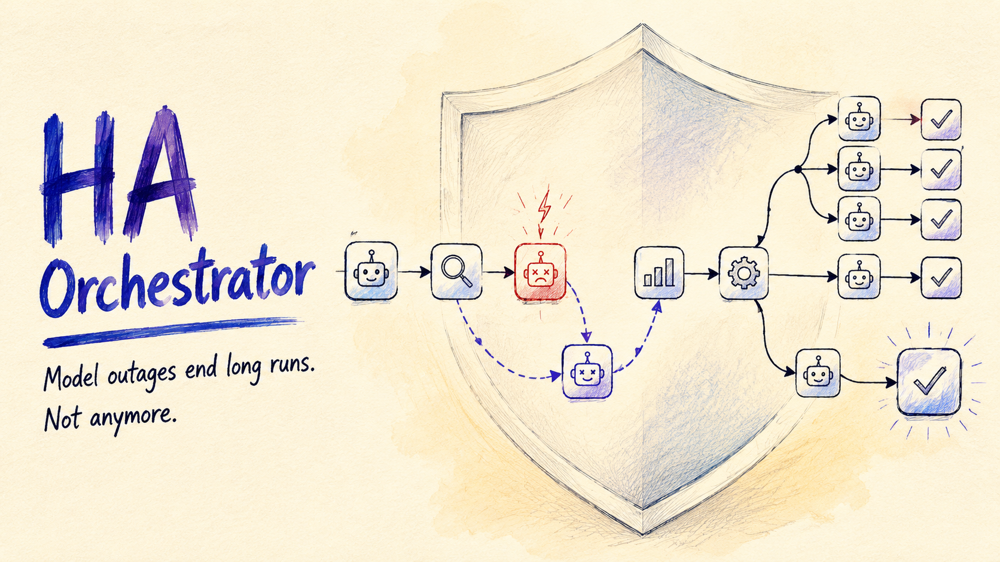

# HA Orchestrator

[](https://github.com/Saktawdi/ha-orchestrator/releases/tag/v0.2.1)
[](https://github.com/deepseek-ai/dsh)
[](LICENSE)

HA Orchestrator 是 [DeepSeek Harness](https://github.com/deepseek-ai/dsh)（dsh）的插件：

- 模型调用中途出错时，自动改用备用模型重试，任务继续跑下去。
- 提供一个 `orchestrate` 工具，模型遇到适合的任务会自己调用它，把工作拆给多个子智能体并行执行（`fanout`）、分阶段执行（`pipeline`），或加一道评审（`supervisor`）。

配置页里还能定义自己的子智能体（也可以一句话让 AI 生成）；界面和提示词文案支持中英文，跟随 DSH 语言。

[English](README.md)

## 功能

### 模型失败自动回退

- 模型请求出错时，自动改用下一个备用模型重试，备用模型按顺序轮换。
- 出错的模型被暂时跳过（进入冷却），冷却结束后自动恢复使用。
- 每次故障有重试上限，用尽后停止重试，不会无限循环。
- 模型错误中断任务时，插件会把任务重新拉起一次，工作不丢失。

备用模型、冷却时间、失败阈值、错误码过滤都可以在 设置 →「HA 与编排」里调整。

### 编排工具（自动触发）

`orchestrate` 工具在所有会话中可用；工具说明和系统提示词里的引导会让模型在任务可并行、分阶段或需要评审时自己调用：

- `fanout` — 拆成子任务并行执行，再汇总结果。
- `pipeline` — 各阶段依次执行，上一阶段的输出作为下一阶段的输入。
- `supervisor` — 并行执行子任务后，由监督子智能体审查合并。

如果某次没有自动编排，直接说"用编排"即可。

> 注意：如果当前会话使用 `minimal` / `minimal-v3` 这类 `complete: true` 人设预设，平台会按设计丢弃插件注入的系统提示词段落；此时自动触发仅靠 `orchestrate` 工具描述承载。插件已把“阅读大型项目”等触发条件写进工具描述，但若仍不触发，请直接说“用编排”。

不想让模型自动调用的话，可以在 设置 →「HA 与编排」→「系统」卡片里关掉**上下文注入**；之后在提示词里写"使用 ha-orchestrator 插件进行调用"即可手动触发。

### 自定义子智能体

在配置页定义可复用的子智能体：名称、provider/模型、描述、系统提示词，任务按名称调用，模型随时可以查询清单。「智能新增」按钮：一句话描述需求，由当前模型生成完整定义。

### 中英双语

配置界面和提示词文案支持中文、英文，自动跟随 DSH 语言设置；语言包加载失败时回退中文。也可以在「系统」卡片手动固定语言。

## 安装

需要：[DeepSeek Harness](https://github.com/deepseek-ai/dsh)（web profile）。无构建步骤，无运行时依赖。

### 方法一：一条命令安装（推荐）

需要 PATH 里有 pnpm：

1. 执行一条命令：

   ```sh
   dsh plugin --profile web add "file:<本仓库绝对路径>"
   ```

2. 因为本包声明了 `dsh.bundle.patch`，`dsh plugin add` 会自动把 **ha-orchestrator** 加进 `dsh.profile.bundles` 并应用 `cordis.patch.yml`，无需手写组合行。
3. 无需重启：bundle patch 层会被热加载（Cordis HMR），插件在运行中的进程里直接生效。刷新浏览器页面即可看到配置页。插件同样随进程启动自动加载，重启后依然生效。

### 方法二：手动安装（无需 pnpm）

1. 把本仓库复制到 DSH profile 的 node_modules 下：`~/.dsh/profiles/web/node_modules/ha-orchestrator`
2. 在组合文件 `~/.dsh/profiles/web/cordis.patch.yml` 中加入：

   ```yaml
   - insert:
       - id: ha-orchestrator
         name: ha-orchestrator
   ```

3. 无需重启：profile 的 patch 层会被热加载（Cordis HMR），插件在运行中的进程里直接生效。刷新浏览器页面即可看到配置页。插件同样随进程启动自动加载，重启后依然生效。

### 方法三：让 AI 帮你装

1. 在 DSH 里切换到**创造模式**。
2. 把仓库链接连同一段提示词发给你的 AI（可参考下述提示词）：

   > 把 **ha-orchestrator** 插件（https://github.com/Saktawdi/ha-orchestrator）安装到 DSH 的 **web profile**（`$DSH_HOME/profiles/web`，默认 `~/.dsh/profiles/web`）。本包**现在声明**了 `dsh.bundle.patch`，所以 `dsh plugin add` 会自动更新 `dsh.profile.bundles` 并应用 `cordis.patch.yml`；不要再手动 insert 组合行，也不要改 `cordis.yml`（启动时会被重写）。如果旧版本曾经手动 insert 过 id 为 `ha-orchestrator` 的行，请删除该 insert 段，让 bundle patch 层接管。步骤：
   >
   > 1. **把包装成真实目录，绝不要用软链接/junction。** Node 的 ESM loader 会把模块解析到真实路径，软链接指向插件源码目录后就找不到它的 peer 依赖（`@deepseek-ai/dsh-tools`、`react` 等）；只有 `$DSH_HOME/profiles/node_modules`（安装 fallback）提供这些包。推荐命令（需要 PATH 里有 pnpm）：
   >
   >    ```sh
   >    dsh plugin --profile web add "file:<插件仓库绝对路径>"
   >    ```
   >
   >    `file:` 协议会把内容快照装进 profile 的 `node_modules` 并记录进 `package.json`（之后执行 `pnpm install` 也不会被清掉）。裸路径或 `link:` 会创建软链接，**运行时必然失败**。如果机器上没有 pnpm，就手动把仓库（排除 `.git` 和 `node_modules`）复制到 `~/.dsh/profiles/web/node_modules/ha-orchestrator/`，并在 profile 的 `package.json` 里补上 `file:` 依赖。
   >
   > 2. **无需手写组合行** —— 声明的 `dsh.bundle.patch`（`cordis.patch.yml`）会被自动应用。只需确认 `dsh.profile.bundles` 现在列出了 **ha-orchestrator**。
   >
   > 3. **无需重启进程** —— bundle patch 层会被热加载（Cordis HMR），插件直接生效。用户只需**刷新浏览器页面**让客户端半部（设置 →「HA 与编排」）加载。
   >
   > 4. **完成前必须验证**：
   >    - `dsh --profile web --dump-config` 能看到 `ha-orchestrator` 行。
   >    - 解析探测：在 profile 目录放一个临时 `probe.mjs`，内容为 `await import('ha-orchestrator')`，应输出 `apply,default,inject,name`（验完删除）。
   >    - 会话里能看到 `orchestrate` 和 `list-subagents` 工具；调用 `list-subagents` 能返回已配置的子智能体清单。
   >    - 失败时修根因（包的位置、patch 语法、行 id），重新保存 patch 文件触发 watcher 重载——**不要**靠重启进程"修复"。

3. 安装后插件随 DSH 启动自动加载，重启后依然生效。

> **版本说明：** [v0.1.0](https://github.com/Saktawdi/ha-orchestrator/releases/tag/v0.1.0) 是上一代动态版（经 `cordis_define` 按会话加载），仅作功能预览；从 v0.2.0 起为静态插件，随 DSH 启动自动加载，本 README 描述的是 v0.2.1 及之后的版本。从引入 bundle patch 的版本起，推荐使用方法一（一条命令安装）安装。

## 用法

无需特殊指令，模型自己决定何时编排：

```
你:    帮我调研这三个开源项目，比较许可证和社区活跃度，给出选型建议。
模型:  识别出 3 个独立子任务 → 自动调用 orchestrate（fanout）→ 并行调研 → 汇总对比 → 给出建议

你:    阅读下这个大型项目，梳理整体架构和当前进度。
模型:  按模块/文档/代码拆成多个独立阅读子任务 → 自动调用 orchestrate（fanout）→ 并行阅读 → 汇总架构与进度

你:    先做需求分析，再写设计文档，最后写实现计划。
模型:  自动调用 orchestrate（pipeline）→ 每阶段输出自动成为下一阶段输入

你:    生成一份竞品分析报告，找个资深评审把关。
模型:  自动调用 orchestrate（supervisor）→ 并行分析 → 评审合并 → 输出报告
```

### 配置页

设置 →「HA 与编排」：

| 卡片 | 作用 |
| :-- | :-- |
| 模型高可用 | 开关、备用模型列表（含「推荐备份」）、冷却时间、失败阈值、突发窗口、Provider 熔断阈值、探测恢复、上下文超长降级、错误码过滤、隔离模型与切换历史 |
| 子智能体编排 | 开关、子智能体提供方、默认并发数、单次任务子智能体上限、全局并发上限、流水线阶段重试 |
| 自定义子智能体 | 增删改、排序；「智能新增」用 AI 生成 |
| 诊断 | HA 运行态（隔离含层级/失败计数/游标/探测）与最近编排运行 |
| 系统 | 插件语言（跟随系统 / 中文 / English）、编排引导开关、注入状态、一键导出/导入配置、调试卡片开关 |

## 文档

- [产品化路线图](docs/productization-roadmap.md) —— 分阶段计划与当前进度
- [架构](docs/architecture.md) —— 模块职责、数据流、服务契约
- [配置参考](docs/configuration.md) —— 全部配置项与默认值/钳制规则
- [安全说明](docs/security.md) —— 信任边界与已落地防护
- [验证与发布](docs/verification.md) —— 测试矩阵、门禁、发布步骤
- [兼容矩阵](docs/compatibility.md) —— 已验证 DSH 快照与 peer 策略

## 注意事项

- 配置写入「当前会话 workspace / DSH_HOME、沙箱 workspace-write 可写根、fs 默认 cwd」中第一个可写位置（文件 `ha-orchestrator.config.json`，备份 `ha-orchestrator.config.backup.json`），启动时按相同顺序查找并恢复。
- HA 运行态（隔离、失败计数、轮换游标、切换历史）防抖持久化到 `ha-orchestrator.ha.json`，重启自动恢复；编排运行记录写入 `ha-orchestrator.runs.jsonl`（见 `/orchestrate runs` / `/orchestrate show <runId>`）。
- `/ha status` 查看熔断/计数/游标/探测；`/ha reset` 清空；`/ha probe <provider> <model>` 手动探测模型。

## License

MIT © [Saktawdi](https://github.com/Saktawdi)
