# HA Orchestrator

> *模型挂了，长任务照跑。*

[](README.zh-CN.md)
[](https://github.com/deepseek-ai/dsh)
[](#安装)
[](#项目结构)
[](LICENSE)

<br>

**HA Orchestrator** 是 DeepSeek Harness（dsh）的动态 Cordis 插件：模型失败时自动回退，长任务不中断；
同时给主 agent 提供规划–执行–监督循环。

<br>

**🛡️ 模型高可用回退** — 模型中途出错时，失败模型进入隔离（冷却后自动恢复），请求自动改用备用模型重发，
任务从断点继续，全程无需人工干预。

**🧩 子智能体编排** — 一个 `orchestrate` 工具，三种模式：
`fanout`（并行分发+汇总）、`pipeline`（顺序流水线）、`supervisor`（并行执行后由监督子智能体审查合成）。

**🤖 自定义子智能体** — 在配置页定义名称 / 模型 / 描述 / 系统提示词，任务按名称指定；
也可以一句话让 AI 帮你生成子智能体。

[**English**](README.md) · [高光特性](#高光特性) · [工作原理](#工作原理) · [安装](#安装) · [用法](#用法) · [文档](#文档)

</div>

---

## 高光特性

- **🛡️ 模型高可用。** 挂在请求瀑布流最外层（`agent/request` + `agent/request-error`，`prepend: true`），
  拥有最终决定权。失败（错误码匹配，留空=全部）→ 隔离失败模型 `cooldownMs` → 返回 `{kind: 'retry'}` →
  循环内自动改用下一个备用模型重发，会话 header 持久化为新模型，后续步骤直接走备用。备用列表按 agent
  轮换（round-robin），自动跳过未注册 provider（防 `NO_ADAPTER` 连锁）。
- **↩️ 停止兜底。** 模型错误中断时（`agent/error`），先隔离失败模型，延迟 300ms（等 driver 回卷到 idle）
  用 `agent.steer` 拉起新一轮继续任务；同一 turn 只 steer 一次。
- **🧩 编排工具。** `orchestrate` 基于 `subagents.start`，带并发池、任务上限（`maxAgents`）与
  取消信号透传，按 agent 作用域注册；工具描述始终列出当前已配置的自定义子智能体清单。
- **🤖 自定义子智能体。** 每个定义含 **名称 / 模型 / 描述 / 系统提示词**；`tasks[].agent`、顶层
  `agent`、`supervisorAgent` 按名称指定；模型经 `agentOptions` 路由，系统提示词经 `request.persona` 生效。
- **✨ 智能新增。** 配置页点「智能新增」→ 输入需求 → Host 用当前默认模型生成完整定义（名称/模型/描述/
  系统提示词），JSON 容错解析 + 名称去重后预填编辑表单，确认即生效。
- **🎛️ 可视化配置页。** 设置 →「HA 与编排」：备用模型列表（从已装 provider 选取）、冷却/阈值/错误码/
  停止引导开关、隔离表与切换历史；Run 卡片有实时 HA 状态条。
- **🎨 OpenDesign token。** 配置页消费全局 OpenDesign 语义 token（`--dsw-alias-*`），亮暗主题均正确，
  不引入任何设计包依赖。

## 工作原理

HA Orchestrator 是 **DSH 动态 Cordis 插件**，双半身以纯 JS 函数体部署（`host.js` / `client.js`）——
无依赖、无构建；

**回退流程。** 出错 → 错误码匹配 → 计数达阈值 → 隔离 + 选下一个备用（round-robin，跳过已隔离/未注册）→
返回 `{kind: 'retry'}` → 请求改用备用模型重发 → 会话 header 更新 → 任务在备用模型上继续；冷却到期后失败
模型自动恢复：



**生命周期。** 配置持久化到插件目录的 `ha-orchestrator.config.json`（另存 `ha-orchestrator.config.backup.json` 备份），启动时恢复、每次改动即写回；隔离/计数/历史仍在 Host 内存，插件更新或进程重启即重置。

## 安装

HA Orchestrator 是 DSH 动态 Cordis 插件——无包、无构建，只有两个 JS 函数体（`host.js` / `client.js`），由 harness 直接执行。

**第一步，切换到「创造模式（cordis）」会话。** `tool-cordis` 工具集只随创造模式（cordis）preset 装配，普通会话没有 `cordis_define`。插件按会话部署，重启不保留。

**第二步，把安装交给 AI。** 把下面这行发给它：

> 部署 HA Orchestrator 插件：执行 `cordis_define`（kind: `new`，idPrefix: `haorc`），`code.host` 用本仓库 `host.js` 的完整内容，`code.client` 用 `client.js` 的完整内容，然后 `cordis_run`（mode: `run`），完成后告诉我结果。

AI 会从仓库读取两个文件，向 harness 注册插件并启动。

**第三步，在 Run 卡片批准。** 新 Package 首次运行处于 awaiting-approval，点击 ✓ 即批准——这是 UI 手势，与会话审批策略无关。

**第四步，验证。** `Tool.listTools` 应含 `orchestrate`；设置页出现「HA 与编排」；HA 监听器在事件目录可见。

**后续更新。** `cordis_define`（kind: `existing`）追加新 Package → `cordis_run`（mode: `update`）即完成热更新。

## 用法

安装完成后直接对话，模型自行决定是否编排：

```
你:     帮我调研这三个开源项目，比较许可证和社区活跃度，给出选型建议。
模型:   (拆解为 3 个独立子任务，调用 orchestrate mode=fanout)
        → 并行调研 → 汇总对比表 → 给出建议

你:     先做需求分析，再写设计文档，最后写实现计划。
模型:   (调用 orchestrate mode=pipeline)
        → 每阶段输出自动成为下一阶段上下文

你:     生成一份竞品分析报告，找个资深评审把关。
模型:   (调用 orchestrate mode=supervisor, supervisorAgent=reviewer)
        → 并行分析 → 评审合成 → 输出报告
```

**配置页导览**（设置 →「HA 与编排」）：

| 区域 | 可做的事 |
| :-- | :-- |
| 模型高可用 | 开关；备用列表（从已装 provider 添加、排序、删除）；冷却时长、失败阈值、错误码过滤、持久化选择、停止引导；隔离表与切换历史；一键重置 |
| 子智能体编排 | 开关；子智能体提供方；默认并发数；单次编排任务上限 |
| 自定义子智能体 | 增删改+排序；名称必填、provider/model 可留空（继承父路由）、描述展示给模型、系统提示词即 persona；「智能新增」用 AI 生成 |

## 特性参考

| 特性 | 行为 |
| :-- | :-- |
| HA 回退 | 瀑布流最外层监听；隔离+冷却+round-robin 备用；按 agent 轮换游标；跳过未注册 provider |
| 停止兜底 | `agent/error` 命中模型错误码 → 先隔离 → 延迟 `agent.steer`（每 turn 一次） |
| `orchestrate` 工具 | `fanout` / `pipeline` / `supervisor`；`tasks[]`、`agent`、`supervisorAgent`、`concurrency`；未知子智能体名报错并列出可用清单 |
| 自定义子智能体 | 名称 / provider+model（`agentOptions`）/ 描述 / 系统提示词（`persona`）；变更后工具描述自动刷新 |
| 智能新增 | `agents.generate` RPC：当前默认模型生成定义，容错解析 JSON 围栏，名称自动去重 |
| 配置 RPC | `state.get` / `state.set`（sanitize 后合并）/ `models.list` / `agents.generate` / `ha.reset` |
| 配置持久化 | 插件目录下 JSON 文件 `ha-orchestrator.config.json` + `ha-orchestrator.config.backup.json`；启动时恢复（backup 兜底），每次 `state.set` 写回 |
| UI | 设置页（order 12）+ Run 卡片状态条（`tool.view.cordis`，key `self`）；OpenDesign 语义 token |

## 项目结构

```
ha-orchestrator/
├── host.js               # Host 半身 —— code.host 函数体（原样部署）
├── client.js             # Client 半身 —— code.client 函数体（原样部署）
├── README.md             # 英文文档
├── README.zh-CN.md       # 本文档（简体中文）
├── docs/
│   ├── flowchart.svg     # 渲染图（英文）
│   └── flowchart-cn.svg  # 渲染图（中文）
├── .gitignore            # 排除 raw.json、运行时配置持久化与生成产物
├── .gitattributes        # 统一 LF 行尾
└── LICENSE               # MIT
```

`raw.json`（不入库）是本地 inspect 导出基线，用于校验 `host.js` / `client.js` 与已部署包同步。

## 文档

| 文档 | 何时阅读 |
| :-- | :-- |
| [README.md](README.md) | English docs |

## 注意事项

- **配置持久化。** 配置保存在插件目录的 `ha-orchestrator.config.json`（附 `ha-orchestrator.config.backup.json` 备份），启动时恢复、改动即写回；隔离/计数/历史仍为内存态，插件更新或进程重启后重置。
- **零依赖。** 纯 JS；沙箱内无 `process` / `fetch` / `require` / `setTimeout`，计时走 `ctx.get('timer')`。
- **按 agent 作用域注册。** `orchestrate` 按 agent（`agent.ctx`）注册，避免与其他会话残留的全局同名
  注册冲突。
- **与审批策略无关。** Run 卡片的 ✓ 是 UI 手势，与会话审批策略无关。

## License

MIT © [Sakta_wdi](https://github.com/Sakta_wdi)
